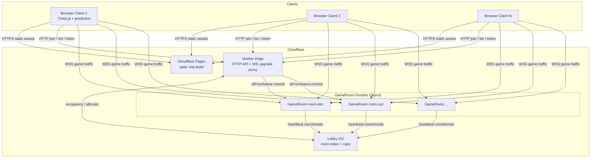
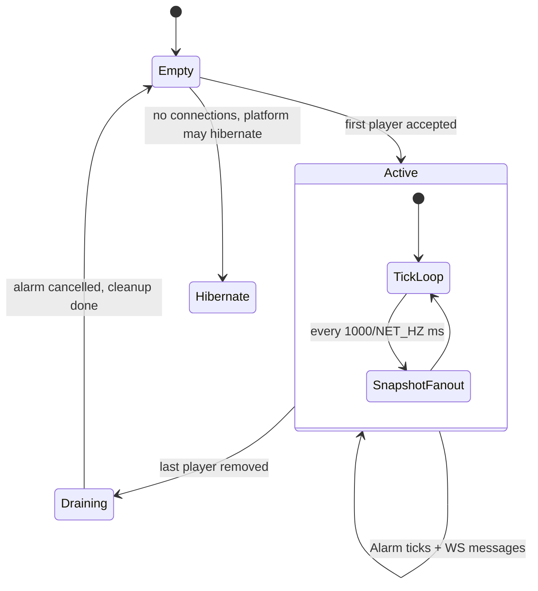
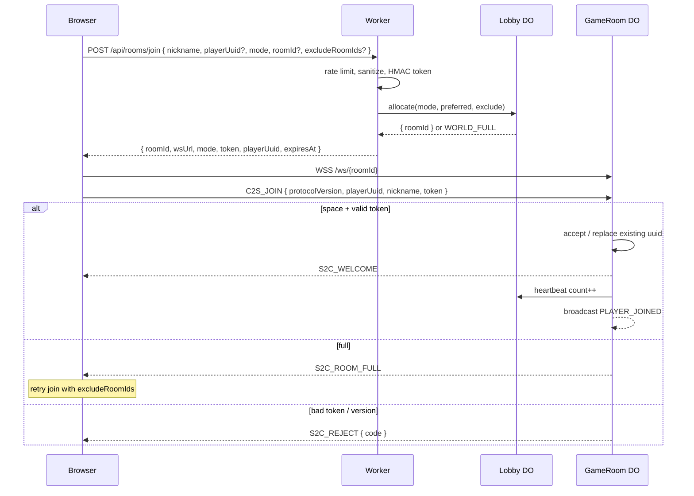
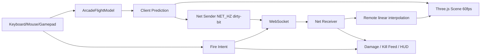
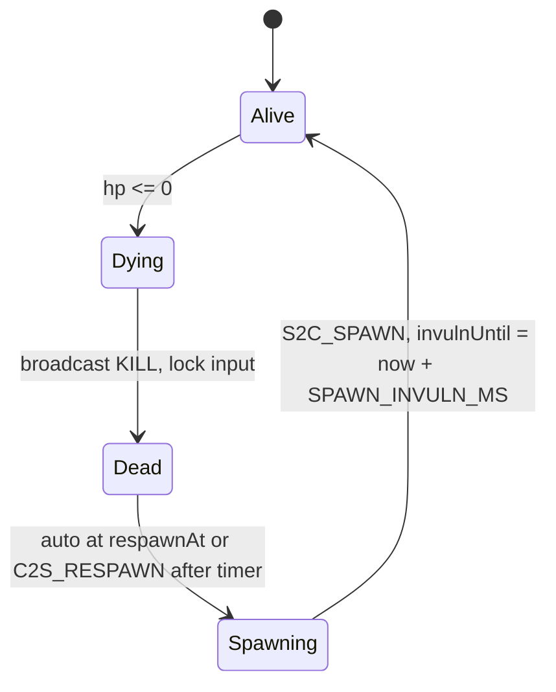
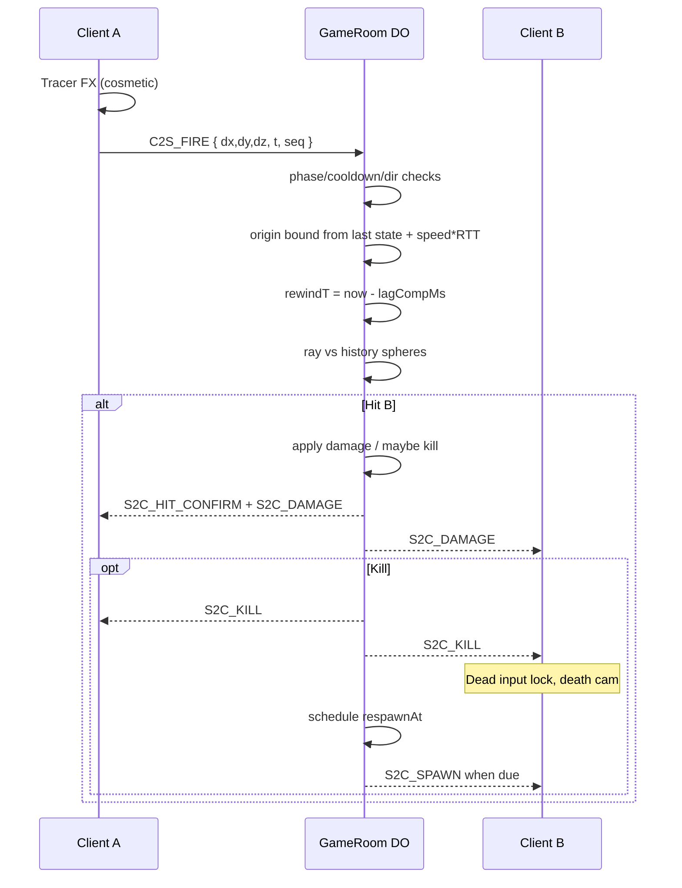
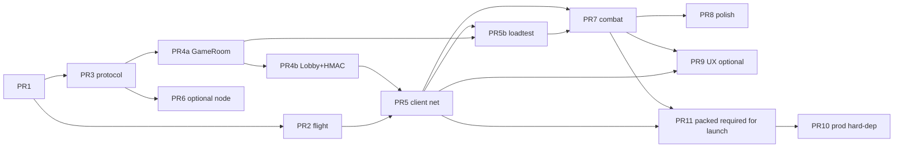

# Design Document: Browser Multiplayer Flight Combat Simulator

| Field | Value |
|-------|--------|
| **Title** | Browser Multiplayer Flight Combat Simulator ("Flight Sim") |
| **Author** | Engineering (TBD) |
| **Date** | 2026-07-06 |
| **Status** | Draft (Rev 4 — Issue 31 server-authoritative reconnect) |
| **Product inspiration** | Pieter Levels' [Fly Pieter](https://fly.pieter.com) (viral browser flyer; simple WS broadcast ~10 Hz; nearly crashed under load) |
| **Repo** | `/Users/shubhamgupta/Desktop/my-stuff/xai/temp/flight-sim` (greenfield) |

---

## Overview

We will build a browser-based multiplayer flight simulator with an optional **attack mode** (shooting, damage, kills, respawn), playable by many concurrent users in shared **rooms**. The product prioritizes **arcade feel**, **minimum server resource consumption**, and **honest cost economics**: static hosting stays free; multiplayer game servers are designed for **cheap production on Cloudflare Workers Paid** (or a small VPS/Fly fallback), with **Free-tier dogfood** only at deliberately reduced concurrency and tick rates.

The architecture pushes almost all simulation work to the client (Three.js flight model, rendering, local prediction). The server is a thin, room-sharded relay and **combat authority**: it validates fire events (with **lag-compensated hitscan**), tracks HP/scores, and broadcasts state at a configurable **10 Hz default** (15 Hz optional on Paid). Primary stack: **Cloudflare Pages** (static client) + **Cloudflare Workers + Durable Objects** — one **Lobby DO** for matchmaking occupancy, one **GameRoom DO** per room. Rooms default to **16–24 players on cost-sensitive tiers** (hard max 32). Horizontal scale is "more rooms," not a bigger process.

**Critical cost honesty (Rev 2+):** continuous 10–15 Hz WebSocket traffic keeps active rooms **awake** and generates **billable DO request-equivalents** that **will exhaust Free plan quotas** at even modest multiplayer scale. Free is for development and tiny playtests; **public/viral multiplayer assumes Workers Paid** (or fixed-cost VPS). See [Appendix E — Cost model](#appendix-e--cost-model-do-requests-duration).

Implementation is planned as incremental, independently reviewable PRs: single-player flight first, then multiplayer sync + load tests, then combat, then production hardening.

---

## Background & Motivation

### Why this product

Fly Pieter demonstrated that a lightweight browser flyer with multiplayer presence can go viral on X/Twitter. The viral path also exposed the failure mode: a simple Python WebSocket server broadcasting every player position to every other player at ~10 Hz is O(n²) bandwidth and CPU, and a single process will choke under concurrent load.

### Current state

Greenfield empty repository. No legacy constraints. We design for:

1. True multiplayer shared rooms (not single-player with fake bots only).
2. Attack mode as a first-class feature, not a bolt-on.
3. **Dual-path economics**: free/cheap for early dogfood; **Paid Workers (or VPS)** as the realistic public multiplayer plan — without pretending continuous game ticks are free.

### Pain points to avoid (learned from viral browser games)

| Pain | How this design addresses it |
|------|------------------------------|
| One giant process | Room/shard isolation; one GameRoom DO per room |
| JSON chatty protocol | MessagePack MVP; packed binary snapshots before public scale |
| Unbounded fan-out | **Room caps** (default 16 dogfood / 24 public / 32 hard max); full-room broadcast only (no false claim of AOI in MVP) |
| Always-on VM cost | Prefer pay-per-use CF; hibernate **empty** rooms; accept active rooms are continuous-compute |
| Server physics cost | Client kinematic flight; server validates bounds/speed/hits only |
| Heavy asset pipeline | Procedural/low-poly planes, simple ground + skybox |
| Free-tier surprise bills / hard stop | Explicit cost model; dogfood caps; Paid for launch |

---

## Goals & Non-Goals

### Goals

1. **Flight**: Arcade Three.js flyer (pitch/yaw/roll, throttle, simple ground collision).
2. **Multiplayer guest sessions**: Multiple players establish a **guest session** (nickname + client UUID + **HMAC session token**) and co-exist in shared rooms. (Not a full "login"/account system.)
3. **Attack mode**: Free-flight and deathmatch; primary weapon fire; HP; death/respawn; kill feed; session scoreboard.
4. **Scalability at low cost**: **Hundreds** of concurrent players via many small rooms on **Paid** (or multi-instance VPS); RAM and bandwidth bounded per room. Free tier targets **tens** of concurrent for dogfood only.
5. **Hostable cheaply**: Static client on Pages/GitHub Pages (free). Game logic on CF Workers + DOs (**Paid for public multiplayer**) or documented Fly/VPS fallback. Free CF plan supported only with **reduced `TICK_HZ` / `MAX_PLAYERS` / global concurrent caps**.
6. **Implementation readiness**: Concrete monorepo layout, **complete** protocol schemas, game loops, lifecycle, matchmaking, and ordered PR plan.

### Non-Goals (MVP and near-term)

- Full FSX/MSFS aerodynamic fidelity.
- Persistent MMO: accounts, economy, clans, long-term progression DB (optional later).
- Native mobile apps (responsive web is enough).
- Voice chat; text chat deferred to phase 2.
- Photoreal / GIS terrain streaming.
- Server-side full physics engine or authoritative flight integration every tick.
- Strong anti-cheat (aim bots, multi-box farms, advanced movement exploits). **Basic** server validation only; residual arcade cheats accepted.
- Guaranteeing multiplayer on Cloudflare **Free** at viral scale (explicitly out of scope as a success criterion).

---

## Key Decisions

| # | Decision | Choice | Rationale |
|---|----------|--------|-----------|
| 1 | **Primary hosting stack** | Cloudflare Pages + Workers + DOs (Lobby DO + 1 GameRoom DO / room) | Lowest ops for room sharding; **production assumes Workers Paid**. Free only for dogfood with hard caps |
| 2 | **Authority model** | Hybrid: client predicts flight; server authoritative for combat, HP, scores, spawn, crash damage | Responsive flight; combat hard to spoof |
| 3 | **World model** | Room/shard; default **24** public / **16** dogfood / **32** hard max | Bounds fan-out and DO CPU; social density still fun |
| 4 | **Protocol** | MessagePack array envelope for MVP; **packed binary `S2C_SNAPSHOT` required before public launch** (PR 11) | MVP velocity vs measured egress; packing not optional for viral |
| 5 | **Tick rates** | Render 60 fps; default **NET_HZ = 10** uplink/downlink; **15 Hz optional** on Paid; combat event-driven; **dirty-bit uplink** (skip identical states) | Cuts DO request volume vs always-15; still Fly-Pieter-class feel |
| 6 | **Physics on server** | None (kinematic validation only) | Minimizes DO CPU |
| 7 | **Flight model** | Arcade; optional soft stall; **Y-up, meters, right-handed** | Fast to ship; shared units |
| 8 | **Assets** | Procedural/low-poly planes; flat ground + skybox/fog | Small static footprint |
| 9 | **Auth** | Guest session: nickname + UUID + **required HMAC token** from Worker on join | Binds nickname/uuid for kill attribution within session TTL; not strong identity |
| 10 | **Combat hit detection** | Server hitscan with **~100–150 ms position history rewind** (lag compensation); speed-integrated origin bound | Fair aim at 80–150 ms RTT; reduces origin spoof surface |
| 11 | **Client framework** | Vite + TypeScript + Three.js (vanilla) | Lightweight |
| 12 | **Monorepo** | `client/`, `server/`, `shared/` + pnpm workspaces | Shared protocol + **shared validation helpers** |
| 13 | **Fallback host** | Bun/Node multi-room on Fly.io **or** small dedicated VPS (Hetzner-class) | Predictable WS cost if DO request economics worse than expected |
| 14 | **Interest management MVP** | **Full room broadcast only** (n≤32); no AOI in MVP | Simplicity; AOI deferred if room size grows |
| 15 | **Matchmaking** | **Lobby Durable Object** with room roster + heartbeats; **`globalPlayers = sum(room.count)`** enforced on every allocate; MVP single `lobby-v1`, mode-sharded v1.1 under load | Worker alone cannot know occupancy; global seat cap is hard |
| 16 | **DO tick / lifecycle** | Active room: **Alarm-driven tick** at `NET_HZ`; Hibernatable WebSockets; empty room: cancel alarm, allow hibernate | Hibernation saves **idle** cost only, not full deathmatch rooms |
| 17 | **Wire rotation** | **Euler yaw/pitch/roll (radians as f32)** on MVP MessagePack; packed snapshot may quantize later | One representation; no quat on wire in MVP |
| 18 | **Snapshot includes self** | Yes — client uses remote list for others; may use own entry only for rare soft correction (`S2C_CORRECT`) | Simple server code path |
| 19 | **Dead-player input** | Server **ignores** `C2S_STATE` movement apply and **all** `C2S_FIRE` while not `Alive`; client input-locked in death cam | Anti shoot-after-death |
| 20 | **Coordinate system** | Three.js default: **Y-up, meters**, map XZ ground plane | Shared by client/server constants |
| 21 | **Production billing tier** | **Workers Paid** for public multiplayer; Free for CI/dogfood caps only | Aligns goals with DO request reality |
| 22 | **Room config bootstrap** | Idempotent `GameRoom.setConfig({ mode, max })` from Worker/Lobby **before** client connect; client cannot set mode | Avoids peaceful/DM misconfig and roomId-parse fragility |
| 23 | **Global seat accounting** | `globalPlayers = sum(room.count)`; **hard-reject all HTTP allocates at cap with no client flag exceptions**; still-seated reconnect is **WS rebind only** (no new seat) | Makes GLOBAL_MAX_PLAYERS real; no client `isReconnect` bypass |
| 24 | **Packed snapshot format** | Appendix G v1 little-endian 26 B/player records in msgpack bin | PR 11 implementable without redesign |
| 25 | **Lobby failure policy** | Fail closed for **new** seats (503). Direct WS allowed only for **uuid already in that room roster** (rebind). No Lobby-skip for new admits | Avoids uncapped shadow matchmaking |
| 26 | **Reconnect model** | **A:** Still-seated = GameRoom WS rebind (server sees uuid in map). After seat freed, full allocate under global cap (WORLD_FULL OK). Optional later: short HMAC reconnect ticket (B) | Server-authoritative; never trust client `isReconnect` |

---

## Proposed Design

### High-level architecture



**Data plane principle:** static assets never touch the game server. Matchmaking is Worker + **Lobby DO**. Each room is an isolated GameRoom DO with Hibernatable WebSockets and in-memory game state. Viral load = more rooms (bounded by **global concurrent player/room caps** on Lobby), not one hotter process.

**WS traffic locality note:** Pages assets are globally CDN-cached; **WebSocket game sessions pin to the Durable Object’s location**. Distant players may see higher RTT. Future: region-prefixed room ids (`eu-dm-3`, `na-dm-1`) selected by client timezone or CF `cf-ipcountry` — not MVP-required but designed-for.

### Deployment topology (primary)

| Component | Host | Notes |
|-----------|------|-------|
| `client` build | Cloudflare Pages | Free tier OK; global CDN; SPA fallback |
| Matchmaking / API | Cloudflare Worker | Issues HMAC tokens; Origin checks; rate limits |
| Lobby index | Durable Object `Lobby` | Room list, global caps, disable flags |
| Game room | Durable Object `GameRoom` | Hibernatable WebSockets; Alarm ticks; memory state |
| Shared protocol | Bundled into client + worker | From `shared/` package |

**Recommendation (revised):** **Option A (CF Pages + Worker + DO)** remains primary for ops and room isolation, with the explicit caveat that **public multiplayer runs on Workers Paid**. Use **Option B (Fly/Bun)** or **Option G (cheap VPS)** if measured DO request/duration cost exceeds a small always-on VM for the same concurrent load. Keep **one wire protocol** so servers are swappable.

### Dual-path hosting economics

| Path | Use case | Caps (defaults) | Billing |
|------|----------|-----------------|---------|
| **Dogfood / Free CF** | Dev, friends, CI | `MAX_PLAYERS=8–16`, `NET_HZ=10`, `GLOBAL_MAX_PLAYERS=32`, `GLOBAL_MAX_ROOMS=4` (seat total **hard-capped** by globalPlayers, not rooms×max) | Stay under Free request/day if lucky; **not guaranteed** |
| **Public / Paid CF** | Viral-ready multiplayer | `MAX_PLAYERS=24` (32 hard), `NET_HZ=10` default (15 optional), `GLOBAL_MAX_PLAYERS` per plan (e.g. 500–2000) | Workers Paid; monitor DO requests + duration |
| **Fixed-cost fallback** | Predictable monthly bill | Same protocol; multi-room in one process or N VMs | Fly paid / Hetzner VPS |

### Capacity & resource budget (quantified)

#### Encoding: two budgets (do not mix)

| Budget | Encoding | When valid |
|--------|----------|------------|
| **MVP MessagePack** | Named fields in msgpack maps inside array envelope | PR 3–10 development |
| **Launch packed** | Fixed binary layout for `S2C_SNAPSHOT` player records | **Required before public launch (PR 11)** |

**MessagePack MVP estimate (honest):**

Per player in snapshot object (keys + f64/f32 + ints): typically **~60–100+ bytes** encoded depending on key strings and float width. Design uses **short keys** in codec (`id,x,y,z,ya,pi,ro,th,hp,fl`) to target **~45–70 B/player**.

| Item | MessagePack MVP (est.) | Packed binary (PR 11 target) |
|------|------------------------|------------------------------|
| Per player state | ~55 B | ~24 B |
| Snapshot 24 players | ~1.3–1.6 KB + header | ~600 B |
| Snapshot 32 players | ~1.8–2.3 KB + header | ~800 B |
| Downlink @ 10 Hz (24p) | **~13–16 KB/s per player** | **~6–7 KB/s** |
| Downlink @ 10 Hz (32p) | **~18–23 KB/s per player** | **~8–12 KB/s** |
| Uplink C2S_STATE | ~50–80 B × 10 Hz ≈ **0.5–0.8 KB/s** (lower with dirty-bit skip) | similar / slightly less |

**PR 3 acceptance:** unit test encodes a full 32-player snapshot and **prints/asserts byte length**; fail CI if MessagePack snapshot **> 4 KB** (forces short keys / no bloat).

**Public launch gate:** **ship PR 11 packed snapshots** before marketing a public multiplayer link, **unless** PR 10 includes a written waiver with loadtest evidence MessagePack **&lt; 20 KB/s/player @ 24×10 Hz for 30 min**. Default path is always ship PR 11.

#### Server RAM per room

| Structure | Estimate |
|-----------|----------|
| Per player record + history ring (~1 s × 10–15 samples × ~32 B) | ~1–2 KB |
| 32 players | ~50–100 KB state + rings |
| Runtime / WS | ~0.5–2 MB order-of-magnitude |
| **Target budget** | **&lt; 5–10 MB per active room** |

#### CPU per room (single-threaded DO)

- No physics integration
- Alarm tick: assemble snapshot, fan-out ≤ `MAX_PLAYERS` sockets
- Fire: O(n) ray-sphere with history sample (n≤32)
- **Pass criteria (load test):** p95 tick assemble+broadcast **&lt; 5 ms** at 1 / 8 / 32 players co-located; no unbounded queue growth on join storms (serialize joins)

**Backpressure:** if tick overruns, skip non-critical work that frame (still send snapshot); drop malformed messages; never process &gt; `MAX_MSG_SIZE` (16 KiB).

#### Concurrent players (cost-feasible, not aspirational fantasy)

| Tier | Concurrent guidance |
|------|---------------------|
| Free dogfood | **≤ ~16–32** global (Lobby enforced) |
| Paid starter | **Hundreds** via many rooms (e.g. 20–40 rooms × 24) if budget allows |
| Large viral | Scale room count + plan limits; consider VPS if $ curves better |

Do **not** treat “200 rooms / 6,400 players” as a Free or default plan claim. That is a **horizontal architecture ceiling**, not a free-tier promise.

#### Latency targets

| Metric | Target |
|--------|--------|
| Playable RTT | **80–150 ms** (OK to ~200 ms) |
| Input → local visual | **&lt; 16 ms** (client prediction) |
| Fire → hit confirm | **0.5–1 RTT** |
| Remote interpolation delay | **~100 ms** (tunable) |
| Lag-comp rewind | **clamp(RTT/2 estimate, 50 ms, 150 ms)** or fixed **100 ms** MVP |

#### Cold start / wake

- **Empty room wake:** first WS accept may cold-start DO — show “Joining room…” (budget **&lt; 2 s** p95 under normal CF conditions; can be higher on rare cold starts).
- **Active room:** already warm; no hibernation.
- **Lobby DO:** lightly used; may wake on join bursts — keep lobby handlers cheap.

### DO lifecycle & tick strategy

This section resolves hibernation vs continuous simulation.



#### Rules

1. **Production MUST use Hibernatable WebSockets** (`ctx.acceptWebSocket(ws)` + `webSocketMessage` / `webSocketClose` handlers). Do **not** use long-lived non-hibernating `ws.accept()` patterns that pin duration when idle-with-connections incorrectly — follow current CF Hibernation API docs.
2. **Active room (players &gt; 0):**
   - Schedule `state.storage.setAlarm(now + tickMs)` (or chain alarms) at **`NET_HZ`** (default 10 → 100 ms).
   - On alarm: build `S2C_SNAPSHOT`, send to all connected tags; re-arm alarm if still active.
   - **Alternative allowed:** inbound-driven “coalesce and flush” with max quiescence (e.g. flush at least every 100 ms even if quiet) — Alarm-primary is the default for predictable cadence.
3. **Empty room (players === 0):**
   - Cancel alarm; clear in-memory maps.
   - Allow hibernate/GC. **No tick when empty.**
4. **Hibernation savings apply to idle/empty rooms and idle connected edge cases per CF semantics — not to full deathmatch rooms with 10 Hz traffic.** Active combat rooms are **continuous-compute** and must be costed as such (Appendix E).
5. **Wake restoration:** follow the ordered **[Wake recovery procedure](#wake-recovery-procedure)** below (attachments alone do **not** restore pose/HP/history).
6. **Lobby heartbeats:** GameRoom notifies Lobby on **join/leave/config change** and at most every **5 s** if count changed (coalesce; no fixed 2 s spam). Payload `{ roomId, count, mode, max, disabled? }`. Stale rooms (no heartbeat &gt; 15 s) removed from matchmaking list; `globalPlayers` recomputed from map.

### Wake recovery procedure

Deterministic algorithm when a GameRoom DO wakes with live Hibernatable WebSockets (silent platform hibernate/wake or after eviction with connections still attached). **MVP does not persist pose/HP/scores to `state.storage`** (cost); unexpected wake is a **soft room state reset** for gameplay fields while preserving **identity seats**.

1. **Rebuild seats from sockets**
   - `sockets = ctx.getWebSockets()`
   - For each `ws`: `att = deserializeAttachment(ws)` → must have `{ playerId, uuid, displayName }` (nickname field = **displayName**).
   - Build `Map<PlayerId, PlayerRecord>` and `Map<uuid, PlayerId>`.
   - If two sockets claim the same `uuid`, **keep the most recently accepted** (or arbitrary last); close the other with `4002` superseded.
   - If attachment missing/corrupt: close that socket with `4003` (`MALFORMED`).

2. **Default gameplay fields (memory lost)**
   - `phase = Alive`, `hp = MAX_HP`, `kills = 0`, `deaths = 0`, `damageDealt = 0`
   - Pose: **do not** place at map origin for combat fairness. Set `needsState = true`, hold at **neutral hold pose** `SPAWN_POINTS[playerId % SPAWN_POINTS.length]` (deterministic seat spawn), `history = []`, `invalidStrikes = 0`, `rttEmaMs = null` (unknown).
   - Product copy / optional toast via next snapshot: clients may see a one-tick teleport; acceptable for soft reset. Do **not** claim score continuity across wake.

3. **Omit cold players from hit tests**
   - While `needsState === true`, player is **not a valid hit target** and **cannot fire** (treat like not yet in world for combat).
   - On first **accepted** `C2S_STATE`: clear `needsState`, push history sample, allow fire/hit.

4. **Re-arm alarm**
   - If `players.size > 0`: `setAlarm(now + 1000/NET_HZ)` immediately (do not wait for next inbound message).
   - If `players.size === 0`: cancel alarm; allow hibernate.

5. **Immediate resync**
   - Broadcast `S2C_SNAPSHOT` once after rebuild.
   - Optionally send each client `S2C_CORRECT` to the hold pose (helps local prediction snap).

6. **Lag-comp cold fallback**
   - If a victim has `history.length < 2`, raycast against **current accepted pose only** (no rewind). Same after wake until samples refill (~200 ms at 10 Hz).

7. **Lobby reconcile**
   - Push heartbeat `{ count: players.size, ... }` so Lobby is not stuck with pre-wake counts.

8. **Optional later (not MVP):** periodic `state.storage` roster `{ id, uuid, displayName, hp, kills, deaths, x,y,z,... }` every 30 s to reduce soft-reset pain — budget storage writes explicitly if enabled.

#### PlayerRecord vs attachments

```ts
// In-memory while DO is awake (NOT stored as ws handle across hibernate)
interface PlayerRecord {
  id: PlayerId;
  uuid: string;
  displayName: string;    // may include #suffix; kill feed uses this
  requestedNickname: string; // pre-suffix; matches token payload
  x: number; y: number; z: number;
  yaw: number; pitch: number; roll: number;
  throttle: number;
  hp: number;
  kills: number;
  deaths: number;
  flags: number;
  lastFireAt: number;
  updatedAt: number;      // server ms last accepted state/ping
  lastInputAt: number;    // for idle timeout
  phase: PlayerPhase;     // see combat state machine
  respawnAt?: number;
  invulnUntil?: number;
  // history ring for lag comp: { t, x, y, z }[]
  history: PositionSample[];
  invalidStrikes: number;
}

// WebSocket attachment (serializable) — source of truth for reconnect mapping
interface WsAttachment {
  playerId: PlayerId;
  uuid: string;
  displayName: string;  // post-suffix name used in kill feed
}
```

Resolve socket for a player via tag/attachment scan or `Map<PlayerId, WebSocket>` **rebuilt on wake**, never assume a stored `ws` field survives hibernation.

### Matchmaking (Lobby DO)

#### Problem

A stateless Worker **cannot** know which GameRoom DOs are full. Occupancy lives in each room (and must be **indexed**).

#### Design

1. **Lobby DO (MVP):** `idFromName("lobby-v1")` — single coordinator for all modes.
2. **Lobby state:**
   ```ts
   interface LobbyRoomMeta {
     roomId: string;
     mode: 'peaceful' | 'deathmatch';
     count: number;      // last known admitted players (from room heartbeats / reconcile)
     max: number;        // per-room cap at create/config time
     lastBeat: number;
     disabled: boolean;
   }
   // globalPlayers is NOT a free-floating counter: always
   // globalPlayers := sum(r.count for r in rooms.values())
   // recomputed at start of every allocate / on heartbeat apply
   ```
3. **`allocate({ mode, preferredRoomId?, excludeRoomIds? })` algorithm (authoritative seat math):**

   **There is no `isReconnect` parameter and no global-cap bypass.** Every successful allocate is a request for a **new or additional seat-assignment path** that must fit under `GLOBAL_MAX_PLAYERS`. Still-seated players do **not** call allocate (see [Server-authoritative reconnect](#server-authoritative-reconnect)).

   1. Drop stale rooms (`now - lastBeat > 15_000`); recompute `globalPlayers := sum(r.count)`.
   2. **Hard global seat gate (all allocates):** if `globalPlayers >= GLOBAL_MAX_PLAYERS` → `{ error: "WORLD_FULL" }` **even if some room has spare seats**. (e.g. Free 32 global cannot become 48 via partial rooms.)
   3. **Preferred room:** if `preferredRoomId` set, not in `excludeRoomIds`, not disabled, `count < max` → return it (global gate already passed).
   4. **Else pack:** among rooms with matching `mode`, not disabled, not excluded, `count < max`, pick **highest `count`** (fullest non-full).
   5. **Else create:** if `rooms.size < GLOBAL_MAX_ROOMS` **and** `globalPlayers < GLOBAL_MAX_PLAYERS`:
      - `roomId = "${mode}-" + randomId(8)` (CSPRNG; not sequential).
      - `max = min(MAX_PLAYERS_TIER, GLOBAL_MAX_PLAYERS - globalPlayers)`.
      - Insert meta `{ count: 0, max, mode, ... }`.
      - **Bootstrap:** Worker/Lobby **must** call `GAME_ROOM.get(idFromName(roomId)).setConfig({ mode, max })` **before** returning allocate (idempotent). GameRoom **ignores client-supplied mode**; roomId prefix is cosmetic only.
   6. Else → `{ error: "WORLD_FULL" }`.

   **Count honesty:** Lobby `count` updates from GameRoom heartbeats on **admit/leave** only (including rebind: **count unchanged**). Allocate never optimistically `count++`. Optional v1.1 reservation tokens — not required for MVP.

4. **Join algorithm (Worker) — new seat only:**
   - Rate-limit IP (token bucket: **10 joins/min/IP**).
   - Sanitize **requested** nickname; generate or accept `playerUuid`; mint **HMAC session token** over `protocolVersion.playerUuid.requestedNickname.expMs`.
   - Call Lobby `allocate({ mode, preferredRoomId?, excludeRoomIds? })` — **no reconnect flag**.
   - On success, `setConfig` on room stub; return `{ roomId, wsUrl, mode, maxPlayers, token, playerUuid, expiresAt }` with `wsUrl = wss://<host>/ws/${roomId}`.
   - On `WORLD_FULL`: HTTP **409** body `{ error: "WORLD_FULL" }`; client shows “Server full — try again.”
5. **Admission (GameRoom) on `C2S_JOIN`** — see reconnect section for branching:
   - Verify token (uuid + requested nickname + exp).
   - **If `playerUuid` already in room roster:** **rebind** (replace WS, keep id/scores/HP/displayName); **do not** change `count`; send `S2C_WELCOME`. Close old WS `4002` if present.
   - **Else if `players.size >= max`:** `S2C_ROOM_FULL` (`4001`). Client retries allocate with `excludeRoomIds` (must pass global gate again).
   - **Else:** **new admit** — create `PlayerRecord`, `count++` (via heartbeat to Lobby), `S2C_WELCOME`, broadcast `PLAYER_JOINED`.
   - **Important:** GameRoom **must not** admit a uuid that is **not** already seated when the only path was “client skipped Lobby” (see degraded mode). New admits are expected after a successful Worker allocate in the normal path; at global cap the Worker never issues a new allocate, so the only way into a room without allocate is **rebind of an existing uuid**.
6. **GET /api/rooms:** Lobby snapshot only; max 50 entries.
7. **Private/shareable:** preferred `roomId` from URL uses normal allocate (global gate applies) + `setConfig` on first touch.
8. **Abuse caps:** `GLOBAL_MAX_ROOMS` + `GLOBAL_MAX_PLAYERS` both enforced on allocate; per-room `max` on admit.

### Server-authoritative reconnect

**Chosen model: Approach A (WS rebind) + Approach C for “still in roster” semantics. Client boolean `isReconnect` is forbidden and ignored if sent.**

| Situation | Path | Global seats |
|-----------|------|----------------|
| Network blip; uuid **still in** GameRoom map (half-open / not yet idle-removed) | Client opens **same** `wsUrl` directly (may skip Worker/Lobby) + `C2S_JOIN` with valid token | **Unchanged** (rebind) |
| Idle timeout / leave already removed seat | `POST /api/rooms/join` normal allocate (preferred room optional) | Must pass **`GLOBAL_MAX_PLAYERS`**; else `WORLD_FULL` — **acceptable product outcome** |
| Malicious client flag / forged “reconnect” | **No effect** — allocate ignores any `isReconnect`; see room-bound tokens below |

**Closing the direct-WS new-admit hole:** Without a room-bound grant, a cheater could open WS on any underfilled room and take spare seats until `sum(max)` rather than `GLOBAL_MAX_PLAYERS`. **MVP closes this by binding the session token to `roomId` at allocate time** (Approach A + grant embedded in token; equivalent to a short-lived seat grant):

**MVP token upgrade (allocate-bound session + fresh seat claim):**

```text
payload = `${protocolVersion}.${playerUuid}.${requestedNickname}.${roomId}.${iatMs}.${expMs}`
token   = payload + "." + hmac
// expMs = iatMs + SESSION_TTL (e.g. 2h) for rebind/session continuity
// For NEW admit only, also require (serverNow - iatMs) <= SEAT_CLAIM_TTL_MS (60_000)
```

| Path | Checks |
|------|--------|
| **Rebind** (uuid already in this room’s roster) | Valid HMAC; `roomId` matches; `exp` not expired. **Does not** require fresh `iat` (blips up to session TTL OK). **Count unchanged.** |
| **New admit** (uuid not in roster) | Valid HMAC; `roomId` matches; `exp` ok; **`iat` within `SEAT_CLAIM_TTL_MS` (60 s)** of allocate; `count < max`. Then create seat + heartbeat count++. |
| **Wrong room / no token** | `S2C_REJECT` `BAD_TOKEN` / `4003` |

- Re-allocate issues a **new** token (`iat` reset) for the assigned `roomId`.
- Stale allocate (player waits &gt; 60 s before WS): must `POST /api/rooms/join` again (re-runs global gate)—closes “got token at 31/32, join hours later into a partial room” overfill.
- Combined with allocate’s global gate + no client reconnect bypass: **cannot systematically fill every partial room past `GLOBAL_MAX_PLAYERS`**. Brief races (two admits in flight) remain bounded by per-room `max` and are healed by heartbeats—not an unbounded attack.

**Optional later (Approach B):** separate `reconnectTicket` with short TTL for graceful-leave grace without holding seat — **not MVP**; after seat freed, compete as new player.

**Product copy:** “If the server is full when you reconnect after being disconnected for a while, you may need to wait for a seat.”

#### Client reconnect procedure (honest client)

1. Keep `lastRoomId`, `playerUuid`, `token` (room-bound) in memory/sessionStorage.
2. On disconnect: exponential backoff (200 ms → … cap 5 s, jitter).
3. **First:** open `wss://…/ws/${lastRoomId}` and send `C2S_JOIN` with existing token.
   - Success `S2C_WELCOME` → rebind done (still seated) or rare same-room re-admit if grant still valid and seat free.
   - `BAD_TOKEN` / room gone / reject → step 4.
4. **Then:** `POST /api/rooms/join` with `{ playerUuid, nickname, mode, roomId: lastRoomId, excludeRoomIds? }` — **no `isReconnect` field**.
   - Success → new token (possibly new roomId) → open new `wsUrl`.
   - `409 WORLD_FULL` → show full message; retry later.

#### Lobby load budget, SPOF, degraded mode, sharding (v1.1)

| Item | Spec |
|------|------|
| **MVP topology** | Single `lobby-v1` DO |
| **Allocate p95 target** | **&lt; 2 ms** CPU in-handler under dogfood; alert if p95 **&gt; 20 ms** |
| **Join rate** | Worker returns **503** with `Retry-After` if global join QPS &gt; plan limit (e.g. Free 20/s, Paid 200/s token bucket at Worker—not only per-IP) |
| **Heartbeat load** | On change + max 5 s interval; **not** fixed 2 s × N rooms |
| **Failure mode (degraded join)** | **Fail closed for new seats:** Lobby timeout/error → Worker **503** `LOBBY_UNAVAILABLE` (no invented room ids). **Still-seated rebind only:** client may open last `wsUrl` directly; GameRoom accepts **only if uuid already in roster** (rebind) or token is a still-valid **room-bound** grant and `count < max` (same as normal admit rules). **No client `isReconnect` Lobby-skip.** Without Lobby, **new** players cannot obtain a fresh room-bound token → cannot join empty seats to blow the global cap. |
| **Shard trigger (v1.1)** | Mode-sharded lobbies `lobby-deathmatch` / `lobby-peaceful` when allocate p95 &gt; 20 ms **or** sustained joins/s &gt; 100 (Paid). |
| **Risk** | See Risks: **Lobby DO saturation / SPOF** |



### Session lifecycle

| Event | Behavior |
|-------|----------|
| **First join** | Assign `PlayerId`, spawn, `phase=Alive`, attach WS, broadcast `PLAYER_JOINED` |
| **Reconnect same uuid** | **Detach/close old WS** (code `4002` superseded); keep `PlayerId`, scores, HP, phase, **displayName**; rebind attachment; send fresh `S2C_WELCOME` (or `S2C_SPAWN` if dead) |
| **Duplicate concurrent uuid** | Last writer wins (replace connection); no two seats for one uuid |
| **Idle timeout** | If no `C2S_STATE` or `C2S_PING` for **`IDLE_TIMEOUT_MS = 10_000`**, force remove, `PLAYER_LEFT`, free seat (**zombie prevention**) |
| **Clean leave** | Client closes WS; server removes immediately |
| **Half-open / silent drop** | Idle timeout reclaims seat |
| **DO reset / deploy / exception** | All WS close (`1012` service restart or abnormal); clients show **“Room reset — rejoining…”**; scores **not** preserved; may get new room if old empty was GC’d |
| **Intentional product copy** | “Guest session scores last while the room is alive. Clearing browser data resets your identity.” |

#### WebSocket close codes (application)

| Code | Meaning |
|------|---------|
| 4001 | Room full |
| 4002 | Superseded by new connection (same uuid) |
| 4003 | Rejected (see last `S2C_REJECT`) |
| 4004 | Idle timeout / kicked (strikes) |
| 4005 | Room closed (admin/disabled) |
| 1012 | Service restart (when applicable) |

#### Client reconnect

See **[Server-authoritative reconnect](#server-authoritative-reconnect)** — prefer direct WS rebind to `lastRoomId` with **room-bound token**; only then HTTP allocate (no `isReconnect`). Exponential backoff 200 ms → … cap 5 s with jitter.

### Monorepo layout

```text
flight-sim/
├── package.json
├── pnpm-workspace.yaml
├── README.md
├── .github/workflows/ci.yml
├── shared/
│   ├── package.json
│   ├── tsconfig.json
│   └── src/
│       ├── protocol.ts          # all MsgType + interfaces
│       ├── schema.ts            # encode/decode (msgpack + later packed snapshot)
│       ├── constants.ts         # ticks, map, weapons, spawns[], timeouts
│       ├── validate.ts          # shared bounds/speed pure functions
│       ├── math.ts              # vec3, ray-sphere, finite checks
│       └── index.ts
├── client/
│   ├── package.json
│   ├── index.html
│   ├── vite.config.ts
│   ├── public/
│   └── src/
│       ├── main.ts
│       ├── ui/
│       ├── net/                 # ws, clock offset, interp, session
│       ├── flight/              # uses shared constants / optional shared integrate helpers
│       ├── combat/
│       ├── world/
│       ├── entities/
│       └── config.ts
├── server/
│   ├── package.json
│   ├── wrangler.toml
│   ├── tsconfig.json
│   └── src/
│       ├── index.ts             # fetch router, Origin check, WS upgrade
│       ├── auth/token.ts        # HMAC mint/verify
│       ├── lobby/Lobby.ts       # Lobby DO
│       ├── room/GameRoom.ts
│       ├── room/state.ts
│       ├── room/combat.ts
│       ├── room/validate.ts     # wraps shared/validate + strikes
│       ├── room/broadcast.ts
│       └── room/lifecycle.ts    # alarms, attachments, idle sweep
├── server-node/                 # OPTIONAL fallback — not on critical path
│   ├── package.json
│   └── src/
│       ├── index.ts
│       ├── lobbyMem.ts
│       └── roomManager.ts
└── tools/
    └── loadtest/                # fake clients — gate for multiplayer PRs
        └── index.ts
```

### Client architecture



**Core client loops:**

1. **Render loop (`requestAnimationFrame`)** — integrate local flight if `Alive`; step remotes; camera; render; HUD.
2. **Network send (`NET_HZ`, default 10)** — send `C2S_STATE` only if pose/throttle/flags **changed** beyond epsilon **or** at least every **500 ms** keepalive pose (aids idle detection without spam). Always allow `C2S_PING` every 2 s.
3. **Network receive** — snapshots → remote buffers; combat events applied immediately (may arrive **before** next snapshot HP; client treats event as authoritative for HP until snapshot).

### Flight model (arcade)

**Coordinate system (decided):** Y-up, meters, right-handed; ground ≈ plane `y = 0`; playable box `±MAP_HALF_EXTENT` on X/Z, altitude `GROUND_Y … MAX_ALTITUDE`.

**Wire/orientation (decided):** Euler **yaw, pitch, roll** (radians). No quaternion on wire in MVP.

Client integrates; server validates with **`shared/validate.ts`**.

**Controls (MVP):**

| Input | Action |
|-------|--------|
| W/S or ↑/↓ | Pitch |
| A/D or ←/→ | Roll |
| Q/E | Yaw |
| Shift/Ctrl | Throttle up/down |
| Space / mouse | Fire (deathmatch, if Alive) |
| R | Request respawn if Dead and timer elapsed (also auto-respawn) |

**Integration (simplified):**

- `speed = lerp(speed, throttle * MAX_SPEED, dt * ACCEL)`
- Forward from yaw/pitch/roll; `position += forward * speed * dt`
- Soft stall optional at low speed
- Ground clamp cosmetic on client; **HP crash damage is server-authoritative** in deathmatch (client may predict FX only after `S2C_DAMAGE`)
- Map bounds: client soft bounce for feel; **server clamps** accepted position into bounds (same constants from `shared/`)

**No plane–plane collision** (visual overlap allowed). **No physical collision response between players.**

**Constants** (`shared/src/constants.ts`):

```ts
export const PROTOCOL_VERSION = 1;
export const NET_HZ_DEFAULT = 10;
export const NET_HZ_MAX = 15;
export const MAX_PLAYERS_DOGFOOD = 16;
export const MAX_PLAYERS_PUBLIC = 24;
export const MAX_PLAYERS_HARD = 32;
export const MAX_SPEED = 120;            // m/s intended arcade top
export const MAX_SPEED_HARD = 135;       // reject threshold (~12% slack, not 25%+)
export const MAP_HALF_EXTENT = 4000;
export const MAX_ALTITUDE = 2000;
export const GROUND_Y = 0;
export const PLANE_GROUND_OFFSET = 2;
export const PLAYER_RADIUS = 6;          // generous arcade hit sphere (meters)
export const PLAYER_RADIUS_LAG = 7;      // optional slightly larger when using rewind
export const MAX_HP = 100;
export const FIRE_COOLDOWN_MS = 100;
export const MG_DAMAGE = 8;
export const MG_RANGE = 500;
export const RESPAWN_MS = 3000;
export const SPAWN_INVULN_MS = 1500;
export const INTERP_DELAY_MS = 100;
export const IDLE_TIMEOUT_MS = 10_000;
export const HISTORY_MS = 1000;
export const LAG_COMP_MS_DEFAULT = 100;
export const MAX_MSG_SIZE = 16 * 1024;
export const ORIGIN_SLACK_MIN_M = 5;
export const STRIKE_KICK_THRESHOLD = 30; // invalid states per rolling minute
export const GLOBAL_MAX_ROOMS_FREE = 4;
export const GLOBAL_MAX_PLAYERS_FREE = 32;
export const SEAT_CLAIM_TTL_MS = 60_000;  // new-admit token freshness after allocate
export const SESSION_TTL_MS = 2 * 60 * 60 * 1000;

// 12 spawn points — used from combat PR; published early in constants
export const SPAWN_POINTS: ReadonlyArray<readonly [number, number, number, number]> = [
  // [x, y, z, yaw]
  [0, 50, 0, 0],
  [200, 50, 200, Math.PI / 2],
  [-200, 50, 200, -Math.PI / 2],
  [200, 50, -200, Math.PI],
  [-200, 50, -200, 0],
  [400, 80, 0, Math.PI / 4],
  [-400, 80, 0, -Math.PI / 4],
  [0, 80, 400, Math.PI],
  [0, 80, -400, 0],
  [300, 60, 300, Math.PI / 6],
  [-300, 60, -300, -Math.PI / 6],
  [0, 100, 100, Math.PI / 3],
];
```

**Movement cheat residual (accepted):** speed gate blocks large teleports but not perfect trajectory spoofing or “many small steps” near `MAX_SPEED_HARD`. Arcade MVP accepts this; strikes only for NaNs, hard bound breaks, extreme speed.

### Netcode details

#### Client-side prediction

- Local plane integrates immediately when `Alive`.
- Snapshots **include self** but client **does not** hard-snap each tick.
- If server sends `S2C_CORRECT` or self position error **&gt; 40 m** sustained, blend/snap local to server.

#### Remote interpolation (MVP)

- Buffer timestamped states using **server** `S2C_SNAPSHOT.t` only.
- Render at `renderTime = serverNowEstimate - INTERP_DELAY_MS`.
- **Linear** lerp position; **linear** euler interp with unwrap for yaw/pitch/roll.
- **No Hermite in MVP** (no velocity field). Optional later: finite-difference velocity from buffer.
- **Clock offset:** on `S2C_PONG` with `serverTime` and echoed `clientTime`:  
  `rtt = now - clientTime`  
  `offset = serverTime + rtt/2 - now`  
  `serverNowEstimate = now + offset`  
  (standard mid-point estimate; recalculate on each pong, EMA smooth).

#### Interest management

- **MVP: full room broadcast.** No distance AOI.
- Later AOI only if raising caps above 32.

#### Compression

1. MVP MessagePack with **short keys** + size CI guard.
2. **PR 11 before public launch:** packed binary snapshot body.
3. Dirty-bit uplink to reduce request count.

### Attack mode

#### Modes

| Mode | Behavior |
|------|----------|
| `peaceful` | No damage; fire disabled server-side |
| `deathmatch` | FFA; damage on; kills/deaths; respawn |

#### Player phase state machine



| Phase | C2S_STATE | C2S_FIRE | Snapshot representation |
|-------|-----------|----------|---------------------------|
| Alive | Accepted if valid | Allowed if cooldown | Normal; `flags` bit0=alive |
| Dying/Dead | **Ignored** (pose frozen last) | **Ignored** | Included with dead bit; frozen pose; hp=0 |
| Spawning | Ignored until Alive | Ignored | Then normal with invuln bit |

- **Auto-respawn** at `respawnAt` (server schedules on death); `C2S_RESPAWN` allowed only when `now >= respawnAt` (client may send early — ignored).
- **Spawn invulnerability:** `SPAWN_INVULN_MS = 1500`; no damage applied if `now < invulnUntil`.
- **Spawn picker:** random among `SPAWN_POINTS` maximizing min distance to alive enemies (simple O(spawns×players)).
- **Crash damage:** if server detects accepted y ≤ ground + offset at speed &gt; threshold in deathmatch, apply damage on server only; ignore if not Alive.
- **Self-hit:** rays skip attacker id. **Dead targets:** skip. **Multi-hit:** closest t-hit only (single target per shot). Friendly fire N/A (FFA).

#### Hit detection with lag compensation (selected: Approach A)

On `C2S_FIRE`:

1. Reject if `phase !== Alive` or weapon disabled (peaceful).
2. Rate-limit cooldown with 10% jitter slack.
3. Validate direction: finite, non-zero length; normalize. Reject NaN/Inf.
4. **Origin:** do **not** trust client origin freely. Use server’s **last accepted position** + forward offset (nose); allow slack only  
   `slack = min(MAX_SPEED_HARD * rttEstimateSec + ORIGIN_SLACK_MIN_M, 25)`  
   If client sends `ox,oy,oz`, accept only inside that sphere; else use server pos.
5. **`clientTime` / `C2S_FIRE.t`:** hint only, clamped to `[serverNow - 200ms, serverNow + 50ms]`; not trusted raw.
6. **Rewind time (MVP frozen):**
   - Store per-player `rttEmaMs` from **that player’s** ping/pong only; init `null`.
   - **Until attacker has ≥ 3 pong samples:** use **fixed `LAG_COMP_MS_DEFAULT = 100`**.
   - **After:** `rewindMs = clamp(attacker.rttEmaMs / 2, 50, 150)` — **attacker-centric** (not victim RTT).
   - `rewindT = serverNow - rewindMs`.
7. For each other player with `phase === Alive`, not invulnerable, **`needsState !== true`**:
   - If `history.length < 2`: use **current accepted pose** (cold-history fallback; no rewind).
   - Else sample history at `rewindT` (lerp); ray vs sphere `PLAYER_RADIUS` (or `PLAYER_RADIUS_LAG`).
8. Closest hit → damage; if hp ≤ 0 → Dying/Dead flow; broadcast `S2C_DAMAGE`; `S2C_HIT_CONFIRM` to attacker; `S2C_KILL` on kill.
9. Miss: **no** mandatory miss packet (save bandwidth); optional debug only.



**Rejected for MVP:** client targetId aim-assist (B). **Widened spheres (C)** used only as small bonus (`PLAYER_RADIUS` already arcade-generous), not instead of rewind.

#### Scoring & UI

- Session kills, deaths, damage dealt
- Scoreboard: Tab → client may use last `S2C_SCOREBOARD` **or** derive from welcome + kill events; server **pushes** `S2C_SCOREBOARD` on kill and every 5 s
- Kill feed last 5 events

### Auth & identity (guest session)

```ts
// Client localStorage
interface GuestIdentity {
  playerUuid: string; // crypto.randomUUID()
  nickname: string;   // raw preferred; server may suffix
}

// Token payload (HMAC-SHA256) — ROOM-BOUND + iat (Rev 4)
// payload = `${protocolVersion}.${playerUuid}.${requestedNickname}.${roomId}.${iatMs}.${expMs}`
// token = payload + "." + hmac
```

**MVP requirements:**

1. `POST /api/rooms/join` returns signed **room-bound** token with **`iat=now`**, `exp=now+SESSION_TTL`, allocated `roomId`, requested nickname.
2. `C2S_JOIN`: verify HMAC + fields. **Rebind** if uuid seated (session `exp` only). **New admit** also requires **`now - iat <= SEAT_CLAIM_TTL_MS` (60 s)** and `count < max`.

3. **Display name policy:** sanitize requested to `[A-Za-z0-9_ -]{1,16}`. On collision with an existing **displayName** in the room, set `displayName = requested + "#" + hexSuffix` (e.g. `Ace#A1`). **Token is not re-minted** on suffix. Kill feed / scoreboard use **`displayName`**. Reconnect same uuid reuses existing `displayName` if seat still present.
4. **Threat acceptance:** guests can multi-box, clear storage for fresh K/D, share tokens until exp. No durable bans. **Kill attribution is session-integrity only.**
5. Goal language: **guest session**, not “login.”

---

## API / Interface Changes

Greenfield — all interfaces are new.

### HTTP (Worker)

| Method | Path | Body / Query | Response |
|--------|------|--------------|----------|
| `GET` | `/api/health` | — | `{ ok: true, ts, protocolVersion }` |
| `GET` | `/api/rooms` | `?mode=` | `{ rooms: { id, players, max, mode }[] }` from Lobby (max 50) |
| `POST` | `/api/rooms/join` | `{ playerUuid?, nickname, mode?, roomId?, excludeRoomIds? }` — **no `isReconnect`** | `{ roomId, wsUrl, mode, maxPlayers, token, playerUuid, expiresAt }` (`token` is **room-bound**) or `503`/`429`/`409 WORLD_FULL` |
| `GET` | `/ws/:roomId` | Upgrade; check **Origin** allowlist | WebSocket → GameRoom DO |

`wrangler.toml`: bindings `GAME_ROOM`, `LOBBY`; secret `SESSION_SECRET`.

### WebSocket protocol (complete)

#### Envelope (frozen)

MessagePack encode of a **2-element array**:

```text
[ type: uint (MsgType), payload: map with SHORT keys ]
```

- No free-form root maps.
- Unknown `type` → drop.
- `payload` keys are **fixed short strings** documented per message (implementations use TypeScript interfaces; codec maps long names ↔ short keys).
- Max frame: **`MAX_MSG_SIZE` 16 KiB**; larger → close `4003`.

#### MsgType enum

```ts
export enum MsgType {
  C2S_JOIN = 1,
  C2S_STATE = 2,
  C2S_FIRE = 3,
  C2S_RESPAWN = 4,
  C2S_PING = 5,

  S2C_WELCOME = 10,
  S2C_SNAPSHOT = 11,
  S2C_PLAYER_JOINED = 12,
  S2C_PLAYER_LEFT = 13,
  S2C_DAMAGE = 14,
  S2C_KILL = 15,
  S2C_SPAWN = 16,
  S2C_ROOM_FULL = 17,
  S2C_REJECT = 18,
  S2C_PONG = 19,
  S2C_HIT_CONFIRM = 20,
  S2C_SCOREBOARD = 21,
  S2C_CORRECT = 22,
}
```

#### Reject codes

```ts
export enum RejectCode {
  BAD_TOKEN = 1,
  BAD_NICKNAME = 2,
  PROTOCOL_VERSION = 3,
  BANNED = 4,          // reserved
  MALFORMED = 5,
  RATE_LIMIT = 6,
  INTERNAL = 7,
}
```

#### All payload interfaces (logical TS; wire uses short keys)

```ts
export type PlayerId = number; // u16

export interface C2S_Join {
  type: MsgType.C2S_JOIN;
  protocolVersion: number; // PROTOCOL_VERSION
  playerUuid: string;
  nickname: string;
  token: string;           // required
}

export interface C2S_State {
  type: MsgType.C2S_STATE;
  seq: number;             // u32
  t: number;               // client ms (for debug; server uses receive time for validation)
  x: number; y: number; z: number;
  yaw: number; pitch: number; roll: number;
  throttle: number;        // 0..1 logical; wire u8 0..255
  flags: number;
}

export interface C2S_Fire {
  type: MsgType.C2S_FIRE;
  seq: number;
  t: number;               // client ms hint for lag-comp clamp only
  dx: number; dy: number; dz: number;
  weapon: number;          // 0 = MG
  // ox,oy,oz omitted on wire by default; optional debug only
}

export interface C2S_Respawn {
  type: MsgType.C2S_RESPAWN;
}

export interface C2S_Ping {
  type: MsgType.C2S_PING;
  t: number;               // client send ms
}

export interface SnapshotPlayer {
  id: PlayerId;
  x: number; y: number; z: number;
  yaw: number; pitch: number; roll: number;
  throttle: number;
  hp: number;
  flags: number;           // bit0 alive, bit1 invuln, bit2 boost...
}

export interface S2C_Welcome {
  type: MsgType.S2C_WELCOME;
  protocolVersion: number;
  yourId: PlayerId;
  roomId: string;
  mode: 'peaceful' | 'deathmatch';
  maxPlayers: number;        // room cap from setConfig
  serverTime: number;
  players: Array<SnapshotPlayer & { displayName: string; kills: number; deaths: number }>;
  map: { halfExtent: number; maxAltitude: number };
  netHz: number;
}

export interface S2C_Snapshot {
  type: MsgType.S2C_SNAPSHOT;
  t: number;               // server ms
  players: SnapshotPlayer[]; // ALL players including self and dead (frozen)
}

export interface S2C_PlayerJoined {
  type: MsgType.S2C_PLAYER_JOINED;
  id: PlayerId;
  nickname: string;
  x: number; y: number; z: number;
  yaw: number; pitch: number; roll: number;
  hp: number;
  kills: number;
  deaths: number;
}

export interface S2C_PlayerLeft {
  type: MsgType.S2C_PLAYER_LEFT;
  id: PlayerId;
  reason: 'leave' | 'idle' | 'kick' | 'superseded';
}

export interface S2C_Damage {
  type: MsgType.S2C_DAMAGE;
  targetId: PlayerId;
  sourceId: PlayerId;
  amount: number;
  hpAfter: number;
  cause: 'mg' | 'crash';
}

export interface S2C_Kill {
  type: MsgType.S2C_KILL;
  killerId: PlayerId;
  victimId: PlayerId;
  killerName: string;
  victimName: string;
}

export interface S2C_Spawn {
  type: MsgType.S2C_SPAWN;
  id: PlayerId;
  x: number; y: number; z: number;
  yaw: number;
  hp: number;
  invulnMs: number;
}

export interface S2C_RoomFull {
  type: MsgType.S2C_ROOM_FULL;
  roomId: string;
  max: number;
}

export interface S2C_Reject {
  type: MsgType.S2C_REJECT;
  code: RejectCode;
  message?: string;
}

export interface S2C_Pong {
  type: MsgType.S2C_PONG;
  t: number;               // echo client t
  serverTime: number;
}

export interface S2C_HitConfirm {
  type: MsgType.S2C_HIT_CONFIRM;
  targetId: PlayerId;
  seq: number;             // fire seq
}

export interface S2C_Scoreboard {
  type: MsgType.S2C_SCOREBOARD;
  entries: Array<{ id: PlayerId; nickname: string; kills: number; deaths: number; damage: number }>;
}

export interface S2C_Correct {
  type: MsgType.S2C_CORRECT;
  x: number; y: number; z: number;
  yaw: number; pitch: number; roll: number;
  reason: 'bounds' | 'desync';
}
```

#### Ordering guarantees

- **Best-effort** on events vs snapshots: combat events are **authoritative for HP/kill** immediately; next snapshot converges.
- Client applies `S2C_DAMAGE` / `S2C_KILL` even if snapshot still shows old hp for one tick.
- No total order claim across reconnects.

#### Validation sketch (shared + strikes)

```ts
// shared/src/validate.ts
export function isFiniteVec3(x: number, y: number, z: number): boolean {
  return Number.isFinite(x) && Number.isFinite(y) && Number.isFinite(z);
}

export function acceptState(
  prev: { x: number; y: number; z: number; updatedAt: number } | undefined,
  next: { x: number; y: number; z: number },
  now: number,
): 'ok' | 'reject' {
  if (!isFiniteVec3(next.x, next.y, next.z)) return 'reject';
  if (next.y < -50 || next.y > MAX_ALTITUDE + 50) return 'reject';
  if (Math.abs(next.x) > MAP_HALF_EXTENT + 100) return 'reject';
  if (Math.abs(next.z) > MAP_HALF_EXTENT + 100) return 'reject';
  if (prev) {
    const dt = Math.max(0.001, (now - prev.updatedAt) / 1000);
    const dist = Math.hypot(next.x - prev.x, next.y - prev.y, next.z - prev.z);
    if (dist / dt > MAX_SPEED_HARD) return 'reject';
  }
  return 'ok';
}
```

**Strike system:** each `reject` increments `invalidStrikes` in a 60 s rolling window; at **`STRIKE_KICK_THRESHOLD` (30)** → disconnect `4004`. Soft rejects do not apply state.

---

## Data Model Changes

No traditional DB for MVP.

### Lobby state

```ts
interface LobbyState {
  rooms: Map<string, {
    roomId: string;
    mode: 'peaceful' | 'deathmatch';
    count: number;      // from room heartbeats only (not optimistic allocate++)
    max: number;        // set at create via setConfig
    lastBeat: number;
    disabled: boolean;
  }>;
  // globalPlayers is always derived: sum(rooms.values().count)
  // caps from env: GLOBAL_MAX_PLAYERS, GLOBAL_MAX_ROOMS
}
```

### GameRoom config bootstrap

```ts
// Idempotent RPC / stub method before first player join
setConfig(cfg: { mode: 'peaceful' | 'deathmatch'; max: number }): void
// Client cannot override mode. roomId prefix is cosmetic only.
```

### GameRoom state

See `PlayerRecord` above; room holds `mode`, `players`, `nextId`, `netHz`, `disabled`.

### Persistence policy

- MVP: **memory only**. Empty hibernate loses scores.
- Product copy: session scores while room alive.
- Phase 2 optional: storage snapshots.

---

## Alternatives Considered

### A. Cloudflare Pages + Workers + Durable Objects (SELECTED primary)

| Pros | Cons |
|------|------|
| Per-room isolation; low ops | **Request billing on high-Hz WS**; active rooms always-on compute |
| Hibernate empty rooms | Learning curve; WS pinned to DO location |
| Scales to many rooms on Paid | Free tier **not** viral-capable at game ticks |

**Why selected:** Best ops model for shards **if Paid is acceptable**. Rev 2 removes the false claim that Free sustains multi-room 10–15 Hz deathmatch.

### B. Single Node/Bun WebSocket on Fly.io + Pages

| Pros | Cons |
|------|------|
| Simple debug; predictable process cost | Vertical scale limits; multi-machine sticky routing needed later |
| No per-message DO request model | Sleep on free Fly; ops for process health |

**Use:** `server-node` local + optional prod fallback.

### C. PartyKit / managed multiplayer

| Pros | Cons |
|------|------|
| Faster scaffolding | Vendor abstraction; cost opacity |

**Skip MVP.**

### D. Full authoritative server physics — **Rejected** (CPU/feel).

### E. WebRTC mesh/SFU — **Rejected** (complexity; still need authority server).

### F. JSON-only protocol — **Rejected** as primary (bandwidth).

### G. Dedicated small VPS (Hetzner-class) for WS + Pages static (NEW)

| Pros | Cons |
|------|------|
| **Predictable monthly cost**; unlimited cheap WS messages | Ops (patches, restarts); single-region unless multi-VPS |
| Easy Node debug parity | Less automatic room isolation unless coded |

**When to prefer over DO:** if Appendix E measured cost on Paid CF for target concurrent **&gt; ~$5–10/mo equivalent VPS** for same load — switch data plane to VPS, keep Pages.

### H. Lower tick / dirty-bit / smaller rooms as first-class cost design (NEW)

Not merely emergency: **default NET_HZ=10**, dirty uplink, MAX 24 public — competing “design for cost” vs “design for 15 Hz feel.” Chosen as **default**; 15 Hz is opt-in on Paid.

### I. Managed game stacks (Nakama, Colyseus Cloud, Hathora) (NEW)

| Pros | Cons |
|------|------|
| Faster features (matchmaking, auth) | Cost at scale; less control of binary protocol; dependency |

**Defer** unless DO/VPS path stalls.

### J. WebTransport (future)

Possible later transport; protocol messages stay identical. Not MVP.

---

## Security & Privacy Considerations

### Threat model (MVP)

| Threat | Severity | Mitigation |
|--------|----------|------------|
| Spoofed hits | High | Server hitscan + history rewind only |
| Origin spoof on fire | Medium | Speed×RTT integrated bound; ignore free client origin |
| Speed / teleport | Medium | shared validate + strikes; residual small-step cheat accepted |
| Fire rate hacks | Medium | Server cooldown |
| Shoot while dead | Medium | Phase machine ignores fire |
| Client `isReconnect` / cross-room token reuse to overfill global cap | High | **No client reconnect flag**; room-bound tokens; rebind only if uuid in roster; allocate always globally gated |
| Room/DO creation flood | High | Lobby `GLOBAL_MAX_ROOMS`; per-IP join rate limit; room id entropy |
| WS message amplification | Medium | `MAX_MSG_SIZE`; type allowlist; drop malformed |
| Cross-origin WS abuse | Medium | **Origin allowlist** (Pages prod domain + localhost dev) on upgrade |
| Session spoof uuid without token | Medium | **HMAC token required** on join |
| Nickname XSS / impersonation | Low | Sanitize + collision suffix; `textContent` |
| Invalid NaN vectors | Medium | Finite checks; strikes |
| Token multi-box / reset K/D | Low | Accepted for guests; document |
| Nickname in logs | Low | Log playerId primarily; nickname optional; retention = CF log defaults |
| DDoS | Medium | CF network; join 429; WORLD_FULL |

### AuthN/Z

- Guest session + HMAC only.
- Public rooms open; private room codes phase 2.
- **Room disable:** Operator script / wrangler only in MVP (see runbook); Lobby `disabled=true`; GameRoom kicks `4005`; Worker join refuses disabled ids. No public admin API in MVP.

### Data handling

- No email/password.
- Do not log position streams.
- Structured logs: join/leave/kill/reject/errors.
- Guest data: ephemeral.

---

## Observability

### Client

- HUD: FPS, RTT, room id, player count, protocol version mismatch warning.
- `?debug=1`: pos, speed, packet sizes, clock offset.
- Close code toasts.

### Server

| Signal | How |
|--------|-----|
| Join/leave/full/reject | JSON logs |
| Lobby allocate / WORLD_FULL | logs |
| Invalid strikes / kicks | logs |
| Tick duration p95 | periodic sample log |
| Protocol version skew | counter on reject PROTOCOL_VERSION |
| Heartbeat lag rooms | Lobby stale removal log |

### Operability runbook (viral / poison room)

1. **Disable one room (MVP = operator-only, no public admin HTTP):** run internal `scripts/disable-room.ts` (or `wrangler` DO stub call) with **account API token** → Lobby `disable(roomId)` → GameRoom kick all `4005`. Optional later: `POST /api/admin/rooms/:id/disable` with `ADMIN_SECRET` header — **not** in MVP surface.
2. **Global stop:** Worker env `JOIN_DISABLED=1` → `/api/rooms/join` returns 503 maintenance (static site still loads).
3. **Tail:** `wrangler tail` filter on `roomId` / `reject`.
4. **Version skew:** if spike on `PROTOCOL_VERSION` rejects, freeze client deploy or force Pages rollback.
5. **Load test command (as of multiplayer PRs):**  
   `pnpm --filter tools/loadtest start -- --players 32 --hz 10 --room auto`  
   Pass/fail printed (tick p95, errors, bytes/s).

### SLOs (measure via loadtest + tail)

- Join success &lt; 2 s p95 when capacity available.
- Snapshot interval jitter &lt; 50 ms under 32p loadtest.
- Idle seats reclaimed ≤ `IDLE_TIMEOUT_MS + tick`.

---

## Rollout Plan

### Feature flags / env

| Flag | Dogfood | Public |
|------|---------|--------|
| `NET_HZ` | 10 | 10 (15 optional) |
| `MAX_PLAYERS` | 16 | 24 |
| `GLOBAL_MAX_PLAYERS` | 32 | plan-based |
| `GLOBAL_MAX_ROOMS` | 4 | 100+ |
| `ENABLE_COMBAT` | after combat PR | true |
| `JOIN_DISABLED` | false | emergency |

### Staged delivery

1. Single-player static (Pages) — free forever path.
2. Peaceful multiplayer dogfood with Free caps + loadtest gate.
3. Combat friends test.
4. **Enable Paid**; ship packed snapshots; raise caps carefully.
5. Public link.

### Rollback

- Pages rollback; wrangler rollback; join 503 kill switch; per-room disable.

### Cost runbook

| Symptom | Action |
|---------|--------|
| DO requests nearing quota | Drop `NET_HZ` 10→8; enable stricter dirty bits; lower `MAX_PLAYERS` |
| Duration high | Fewer rooms (pack better); ensure empty rooms cancel alarms |
| Egress high | Ship/verify PR 11 packing; reduce net Hz |
| Viral spike $ | Temporary `GLOBAL_MAX_PLAYERS` cut; consider VPS failover |

---

## Risks

| Risk | Severity | Mitigation |
|------|----------|------------|
| **DO request/duration cost at game tick rates** | **Critical** | Paid plan; NET_HZ=10; dirty uplink; caps; VPS fallback; Appendix E |
| **Lobby DO saturation / SPOF** | **High** | Heartbeat coalesce; join QPS 503; fail-closed new joins; reconnect-only bypass; mode-shard lobbies v1.1 when p95/joins trip thresholds |
| Matchmaking race → ROOM_FULL storms | High | excludeRoomIds retry; pack rooms; **GLOBAL_MAX_PLAYERS hard gate on all allocates**; room-bound tokens; rebind does not add seats |
| Hibernation/attachment bugs | High | Lifecycle tests; loadtest reconnect |
| Free-tier treated as prod | High | Docs + Lobby free caps; README banner |
| Cheating residual | Medium | Accept arcade; strikes; HMAC session |
| High RTT unfair gunfeel | Medium | Lag comp rewind + generous radius |
| Protocol skew | Medium | version field; dual server compliance tests |
| DO state loss | Low | Product copy; reconnect UX |
| Single-threaded tick overrun | Medium | Backpressure; 32 cap; measure p95 |
| Scope creep MSFS | Medium | Non-goals in review |

---

## Open Questions

1. After playtest, keep attacker-RTT EMA rewind vs stay on fixed 100 ms always? (MVP algorithm already frozen; this is tuning only.)
2. **Region-prefixed rooms** at launch or later?
3. Private room codes in first multiplayer PR? (design supports preferred roomId)
4. Teams mode post-MVP?
5. Mobile touch — phase 2 default?
6. Product name / domain branding?
7. Re-verify **current** CF Free/Paid DO WS message billing ratios before setting dollar alerts (numbers in Appendix E are planning estimates from public docs at design time — **must re-check**).

---

## References

- Fly Pieter — https://fly.pieter.com
- Three.js — https://threejs.org/docs/
- Cloudflare Durable Objects — https://developers.cloudflare.com/durable-objects/
- Cloudflare Durable Objects **Hibernatable WebSockets** — https://developers.cloudflare.com/durable-objects/api/websockets/
- Cloudflare Durable Objects / Workers **pricing** — https://developers.cloudflare.com/durable-objects/platform/pricing/ (re-verify at launch)
- Cloudflare Pages — https://developers.cloudflare.com/pages/
- MessagePack — https://msgpack.org/
- Fly.io docs — https://fly.io/docs/
- Classic netcode: client prediction, entity interpolation, lag compensation (Valve multiplayer networking literature; apply lightly)

---

## Implementation Notes for Engineers

### Local development

```bash
pnpm install
pnpm --filter client dev
pnpm --filter server dev          # wrangler dev (Lobby + GameRoom)
# optional:
pnpm --filter server-node dev
pnpm --filter tools/loadtest start -- --players 8 --hz 10
```

### First playable DoD

- Single-player flight on Pages.
- Multiplayer peaceful with 8 loadtest clients green.
- Deathmatch with lag-comp hits, respawn, scores.
- Deploy path README for Pages + Worker (Paid note prominent).

---

## PR Plan

Incremental vertical slices. **Minimum public launch path:** PR 1→2→3→4a→4b→5→5b→7→11→10 (PR 6/8/9/12 optional). Combat playtests require spawn safety inside PR 7.

### PR 1 — Monorepo scaffold & shared constants

- **Title:** `chore: monorepo scaffold (client/server/shared) + toolchains`
- **Files:** root workspace, `shared/constants.ts` (incl. spawns stub), CI, README with **Paid vs Free** banner
- **Deps:** none
- **Description:** TS strict, packages, no gameplay.

### PR 2 — Single-player arcade flight

- **Title:** `feat(client): arcade flight model + Three.js scene`
- **Files:** `client/src/flight/*`, `world/*`, `LocalPlayer`, HUD speed/alt
- **Deps:** PR 1
- **Description:** First demoable milestone; static deploy. Uses shared constants for bounds/speed. **No plane-plane collision.**

### PR 3 — Protocol codecs + size guard

- **Title:** `feat(shared): complete MessagePack protocol + encode size tests`
- **Files:** `shared/protocol.ts` (all types), `schema.ts`, `validate.ts`, `math.ts`, tests with **snapshot byte length assertion**
- **Deps:** PR 1
- **Description:** Freeze envelope `[type, payload]`; all MsgTypes; **canonical short-key table** (Appendix H); golden msgpack hex fixtures for `C2S_STATE` + 32p snapshot size assert.

### PR 4a — GameRoom DO peaceful sync + lifecycle

- **Title:** `feat(server): GameRoom DO (hibernatable WS, alarm tick, validation)`
- **Files:** `GameRoom.ts`, `lifecycle.ts`, `broadcast.ts`, `validate` wrapper, wrangler `GAME_ROOM`
- **Deps:** PR 3
- **Description:** Join/state/snapshot at NET_HZ; idle timeout; attachments; room full; **no** sophisticated matchmaking yet (direct roomId for tests OK).

### PR 4b — Lobby matchmaking + HMAC tokens

- **Title:** `feat(server): Lobby DO allocate + HMAC session tokens + rate limits`
- **Files:** `Lobby.ts`, `auth/token.ts`, Worker join/rooms routes, Origin allowlist
- **Deps:** PR 4a
- **Description:** Occupancy index; **`globalPlayers` hard gate on all allocates (no `isReconnect`)**; **room-bound HMAC tokens**; `setConfig`; GameRoom rebind-vs-admit; WORLD_FULL; exclude retry; degraded = rebind-only without Lobby.

### PR 5 — Client multiplayer netcode + session lifecycle

- **Title:** `feat(client): WS multiplayer, interp, reconnect, guest session UI`
- **Files:** `client/src/net/*`, remotes, nickname menu, close-code UX, clock offset
- **Deps:** PR 2, PR 4b
- **Description:** Peaceful multiplayer milestone; implements reconnect/replace uuid policy; dirty-bit send.

### PR 5b — Load test harness (merge gate)

- **Title:** `test: fake-client loadtest for 1/8/32 players`
- **Files:** `tools/loadtest/*`, README command, CI optional job or manual gate checklist
- **Deps:** PR 4a (min), ideally PR 5
- **Description:** Falsify tick p95, bytes/s, error rate. **Required green at 8 players before combat PR merge.**

### PR 6 — Node/Bun fallback (OPTIONAL, non-blocking)

- **Title:** `feat(server-node): protocol-compatible multi-room server`
- **Files:** `server-node/*`
- **Deps:** PR 3; parity with 4a/4b logic
- **Description:** Dev ergonomics / VPS path. **Must run shared protocol compliance tests.** Does **not** block PR 7.

### PR 7 — Combat deathmatch (includes safe spawns)

- **Title:** `feat: deathmatch combat (lag-comp hitscan, HP, spawn safety, scoreboard)`
- **Files:** `combat.ts`, phase machine, client combat/FX/kill feed/scoreboard, mode select
- **Deps:** PR 5, PR 5b (8p loadtest green)
- **Description:** Full attack mode; **spawn points + invuln + auto-respawn in this PR** (not deferred). Crash damage server-side optional flag.

### PR 8 — Bounds/crash feel polish

- **Title:** `feat(game): bounds VFX, crash juice, spawn distance tuning`
- **Files:** client VFX, constants tuning
- **Deps:** PR 7
- **Description:** Non-blocking feel; safe defaults already in PR 7.

### PR 9 — UX menus, touch, SFX (optional for launch)

- **Title:** `feat(client): lobby UX polish, touch, SFX`
- **Deps:** PR 5 / PR 7
- **Description:** Polish; not required for minimum launch path.

### PR 10 — Production deploy hardening

- **Title:** `chore: production Pages+Worker deploy, caps, incident runbook`
- **Files:** wrangler prod, CI deploy, rate limits prod values, README runbooks, `scripts/disable-room.ts`
- **Deps:** **PR 11 (hard)** — public production multiplayer deploy must include packed snapshots **or** attach a **waiver checklist** in the PR description proving loadtest MessagePack **&lt; 20 KB/s/player @ 24×10 Hz for 30 min continuous**. Soft “preferred” is **not** allowed. PR 7 required; PR 9 optional.
- **Description:** Paid plan config, monitoring notes, operator disable-room script, Lobby cap env verification.

### PR 11 — Packed binary snapshots (launch-required)

- **Title:** `perf(protocol): packed binary S2C_SNAPSHOT`
- **Files:** `shared/schema.ts`, client/server snapshot path
- **Deps:** PR 5+
- **Description:** **Required on minimum launch path.** Implement **Appendix G** byte layout exactly; CI size formula assert; keep other messages MessagePack. Envelope carries packed body as msgpack **bin** in payload field `b` (see Appendix G).

### PR 12 — Phase-2 optional

- **Title:** `feat: private room codes + chat stub`
- **Deps:** PR 10
- **Description:** Optional.

**Merge order (revised):**



**Minimum launch path:** 1 → 2 → 3 → 4a → 4b → 5 → 5b → 7 → 11 → 10.  
**Skip for launch:** 6, 8, 9, 12.

---

## Appendix A — Why rooms beat one mega-world

At 10 Hz with MessagePack ~1.5 KB snapshots (24 players):

| Players one world | Approx server egress order |
|-------------------|----------------------------|
| 24 | ~0.4 MB/s |
| 100 | multi-MB/s class |

Shards keep CPU/RAM/request blast radius small. Pack rooms via Lobby for social density without one mega-shard.

## Appendix B — Bandwidth worksheet (24-player room @ 10 Hz)

### MessagePack MVP (planning)

| Direction | Packet | Rate | Bytes/s (approx) |
|-----------|--------|------|------------------|
| Up | C2S_STATE ~60 B | ≤10 Hz dirty | 200–600 |
| Up | C2S_FIRE | burst | 50–100 avg fight |
| Up | C2S_PING | 0.5 Hz | small |
| Down | S2C_SNAPSHOT ~1.5 KB | 10 Hz | **~15,000** |
| Down | events | burst | 200–500 |
| **Total / player** | | | **~16 KB/s** |

### Packed PR 11 target

| Down snapshot | ~600–800 B × 10 Hz | **~6–8 KB/s** |
| **Total / player** | | **~8–10 KB/s** |

WS game egress is **per DO location**, not “magically global like Pages.”

## Appendix C — Minimal `wrangler.toml` sketch

```toml
name = "flight-sim"
main = "server/src/index.ts"
compatibility_date = "2026-01-01"

[[durable_objects.bindings]]
name = "GAME_ROOM"
class_name = "GameRoom"

[[durable_objects.bindings]]
name = "LOBBY"
class_name = "Lobby"

[[migrations]]
tag = "v1"
new_classes = ["GameRoom", "Lobby"]
```

## Appendix D — Minimal client game loop pseudocode

```ts
function frame(t: number) {
  const dt = clock.delta(t);
  const input = sampleInput();
  if (local.phase === 'Alive') integrateArcadeFlight(local, input, dt);
  net.maybeSendState(local, t); // NET_HZ + dirty bit + keepalive
  const serverNow = clock.serverNowEstimate();
  for (const r of remotes) linearInterpolate(r, serverNow - INTERP_DELAY_MS);
  updateCamera(local);
  renderer.render(scene, camera);
  updateHud(local, net.rtt, scores);
  requestAnimationFrame(frame);
}
```

## Appendix E — Cost model (DO requests & duration)

> **Disclaimer:** Cloudflare pricing and the exact mapping of WebSocket messages → billable units change over time. Figures below use the review-era planning model: **~20 inbound WS messages ≈ 1 billable request-equivalent** for illustration. **Re-verify against live CF pricing docs before setting budgets.**

### Inbound message rate (one full room)

Assume all players send state every tick (worst case; dirty-bit reduces this).

| NET_HZ | Players | C2S_STATE msg/s | ÷20 → req-eq/s | req-eq/hour | req-eq/day (1 room full) |
|--------|---------|-----------------|----------------|-------------|---------------------------|
| 10 | 8 | 80 | 4 | ~14.4k | ~346k |
| 10 | 16 | 160 | 8 | ~28.8k | ~691k |
| 10 | 24 | 240 | 12 | ~43.2k | **~1.0M** |
| 10 | 32 | 320 | 16 | ~57.6k | **~1.4M** |
| 15 | 32 | 480 | 24 | ~86.4k | **~2.1M** |

Free plan order-of-magnitude **~100k requests/day** (Workers/DO free allotments vary — treat as **~1 dogfood room for well under an hour at 32×15**, or a few hours at **8×10 with dirty-bit**). **Conclusion: Free cannot be the production multiplayer tier.**

### Concurrent rooms (Paid planning sketch)

| Full rooms @ 24p × 10 Hz | State req-eq/s (agg) | Notes |
|--------------------------|----------------------|-------|
| 1 | ~12 | Tiny |
| 10 | ~120 | Small public test |
| 50 | ~600 | Serious concurrent; **Paid + monitoring** |

Plus: outbound snapshots, pings, fires, join HTTP, Lobby calls, **duration GB-s** for always-awake active DOs (alarm every 100 ms ⇒ continuous residency while non-empty).

### Duration (order-of-magnitude GB-s sketch)

An active room is **not** hibernating. Empty rooms must cancel alarms promptly.

**Planning assumption (re-verify against live CF DO duration billing):** treat each active GameRoom as roughly **128 MB** billable memory class for napkin math (actual class may differ; use as **upper-ish** planning unit, not invoice).

| Active rooms N | Memory | GB-s / hour (N × 0.128 GB × 3600 s) | GB-s / day |
|----------------|--------|--------------------------------------|-----------|
| 1 | 128 MB | ~460 | ~11k |
| 10 | 1.28 GB agg | ~4.6k | ~110k |
| 50 | 6.4 GB agg | ~23k | ~550k |

If published duration price were on the order of **~$0.20 / million GB-s** (illustrative only — **check current pricing page**), then:

| Active rooms | Approx duration $/day (illustrative) |
|--------------|--------------------------------------|
| 1 | pennies |
| 10 | still low vs request cost at game tick rates |
| 50 | still often **smaller than request-equivalent cost** at 24×10 Hz full rooms |

**Implication:** for this architecture, **inbound WS request-equivalents usually dominate** duration at high tick rates; duration still matters for many half-idle rooms left awake (bug: failed alarm cancel). VPS break-even is driven more by **message/request pricing + engineering time** than by GB-s alone.

### Break-even narrative (when to prefer VPS)

| Approach | Economics |
|----------|-----------|
| CF Free | Dev + ≤ tens concurrent (`GLOBAL_MAX_PLAYERS` hard), short sessions only |
| CF Paid | Default public path; watch **request-eq first**, duration second |
| Fixed VPS (~$5–10/mo) | Prefer when measured CF bill for target concurrent (e.g. 10 full rooms × 10+ hrs/day) **exceeds VPS+egress** for same load **or** Lobby/DO limits block scale — switch data plane, keep Pages |

**Control knobs:** `NET_HZ`, dirty-bit, `MAX_PLAYERS`, `GLOBAL_MAX_*`, pack snapshots, pack rooms (fewer half-empty DOs), cancel alarms on empty.

## Appendix G — Packed `S2C_SNAPSHOT` layout (v1) {#appendix-g--packed-s2c_snapshot-layout-v1}

**Status:** design-locked for PR 11. Little-endian throughout.

### Envelope

MessagePack array (same as all messages):

```text
[ type: 11 (S2C_SNAPSHOT), payload: { "f": 1, "b": <BIN> } ]
```

| Key | Meaning |
|-----|---------|
| `f` | Snapshot format version **u8 as int** — must be `1` for this layout |
| `b` | MessagePack **bin** family containing raw packed bytes below |

Do **not** send a second WebSocket frame. Do **not** put raw binary as the sole root without the array envelope (keeps one demux path).

### Binary body (`payload.b`)

```text
offset  size   field
0       u8     formatVersion   // = 1 (redundant with f; must match)
1       u32    serverTimeMs    // little-endian
5       u8     count           // number of player records, 0..MAX_PLAYERS_HARD
6       ...    count × PlayerRecordPacked
```

### `PlayerRecordPacked` (26 bytes each)

```text
offset  size   field
0       u16    id              // PlayerId
2       f32    x
6       f32    y
10      f32    z
14      i16    yawMilli        // yaw rad × 1000, clamped to int16
16      i16    pitchMilli
18      i16    rollMilli
20      u8     throttle        // 0..255 → 0..1
21      u8     hp              // 0..255 (MAX_HP=100 fits)
22      u8     flags           // bit0 alive, bit1 invuln, bit2 needsState/hold, ...
23      u8     _pad            // = 0 (align / future)
---
total 26 bytes per player
```

**Size formula:** `bodyBytes = 6 + 26 * count`  
Examples: 24 players → `6+624 = 630 B`; 32 players → `6+832 = 838 B` (matches Appendix B packed target order).

**Inclusion rules:** same as MessagePack snapshot — **all seats including self and dead** (frozen pose, `flags` alive bit clear). Order: ascending `id`.

**Angle encode:** `milli = clamp(round(rad * 1000), -32768, 32767)`. Decode: `rad = milli / 1000`.

**CI (PR 11):** assert `bodyBytes === 6 + 26 * count` for count=0..32; golden hex for one 3-player fixture.

**MessagePack MVP path:** payload is a map of short keys (Appendix H), not `f`/`b`. Client/server feature-detect: if payload has `b` and `f===1`, use packed decoder; else short-key map.

## Appendix H — MessagePack short-key dictionary (high-frequency) {#appendix-h--messagepack-short-key-dictionary-high-frequency}

Canonical **logical field → wire key**. Codecs in `shared/schema.ts` must use **only** these keys for listed messages. PR 3 acceptance includes golden msgpack hex fixtures.

### `C2S_STATE` payload (`type=2`)

| Logical | Wire | Notes |
|---------|------|-------|
| seq | `s` | u32 |
| t | `t` | client ms |
| x,y,z | `x`,`y`,`z` | f64/f32 as encoder default |
| yaw,pitch,roll | `ya`,`pi`,`ro` | radians |
| throttle | `th` | 0..1 or u8 0..255 (codec normalizes to 0..1 logical) |
| flags | `fl` | u8 |

### `SnapshotPlayer` / players[] element

| Logical | Wire |
|---------|------|
| id | `i` |
| x,y,z | `x`,`y`,`z` |
| yaw,pitch,roll | `ya`,`pi`,`ro` |
| throttle | `th` |
| hp | `hp` |
| flags | `fl` |

### `S2C_SNAPSHOT` payload (MessagePack MVP, not packed)

| Logical | Wire |
|---------|------|
| t | `t` |
| players | `p` | array of SnapshotPlayer maps |

### `C2S_FIRE` payload

| Logical | Wire |
|---------|------|
| seq | `s` |
| t | `t` |
| dx,dy,dz | `dx`,`dy`,`dz` |
| weapon | `w` |

### `C2S_JOIN` / low-frequency messages

May use slightly longer but still fixed keys: `pv` (protocolVersion), `u` (playerUuid), `n` (requested nickname), `tk` (token), `dn` (displayName in S2C), `cd` (reject code), etc. Full map lives in `shared/schema.ts` as `const KEYS = { ... } as const` — **single module is source of truth**; this appendix locks high-frequency names so PR 3/5 cannot diverge.

### Golden fixture policy (PR 3)

- Commit `shared/testdata/c2s_state_v1.msgpack.hex`
- Commit size print for 32-player snapshot map encoding; fail if `> 4096` bytes.

## Appendix F — Shared validation dual-implementation rule

- `shared/validate.ts` and `shared/constants.ts` are the **only** sources for bounds and max speed.
- Client flight integration must use the same numeric constants.
- Server must not fork magic numbers.
- PR 3 includes unit tests for accept/reject vectors.
- Optional later: pure `integrateFlightTick` in shared for spectator checks — not required if constants stay single-sourced.

---

*End of design document (Rev 4).*
